# Monster Maniac

A Production-Grade Full-Stack RPG built using Spring Boot, Next.js, PostgreSQL and Docker.

[](https://spring.io/projects/spring-boot)
[](https://nextjs.org/)
[](https://www.postgresql.org/)
[](https://www.docker.com/)
[](https://www.typescriptlang.org/)
[](https://www.oracle.com/java/)
[](https://tailwindcss.com/)

**Monster Maniac** is a high-performance, containerized multiplayer RPG backend engine paired with a dynamic, pixel-art styled Next.js frontend. Engineered from the ground up following **Clean Architecture** principles, the system delivers secure role-based authentication, real-time turn-based combat calculations, modular inventory and equipment management, complex item crafting, and a full administrative suite.

---

## Application Walkthrough

### Landing Page

Welcome to the vibrant world of Monster Maniac, showcasing high-fantasy aesthetics and entry portals for new and returning warriors.

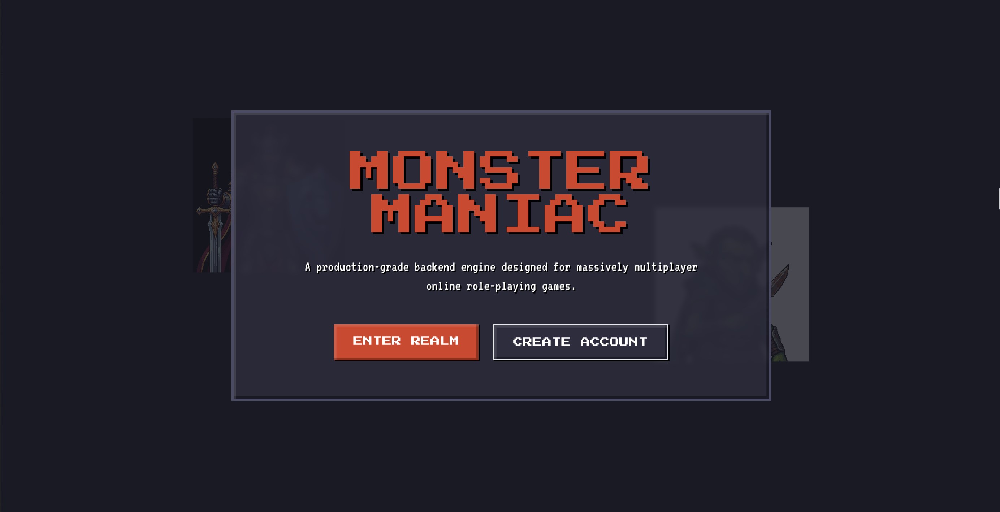

---

### Create Account

Create your secure player profile with real-time validation and instant credential provisioning.

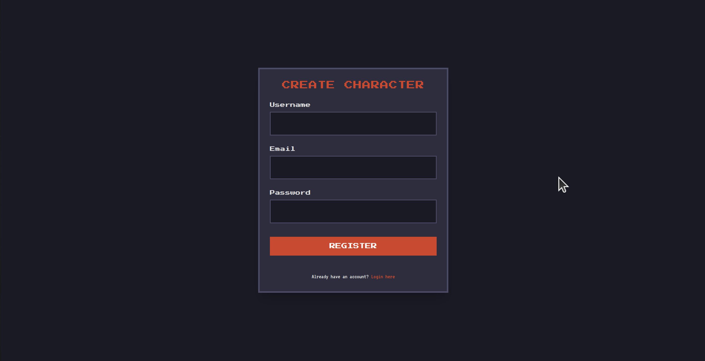

---

### Login Portal

Secure login portal backed by JSON Web Tokens (JWT) and Role-Based Access Control (RBAC).

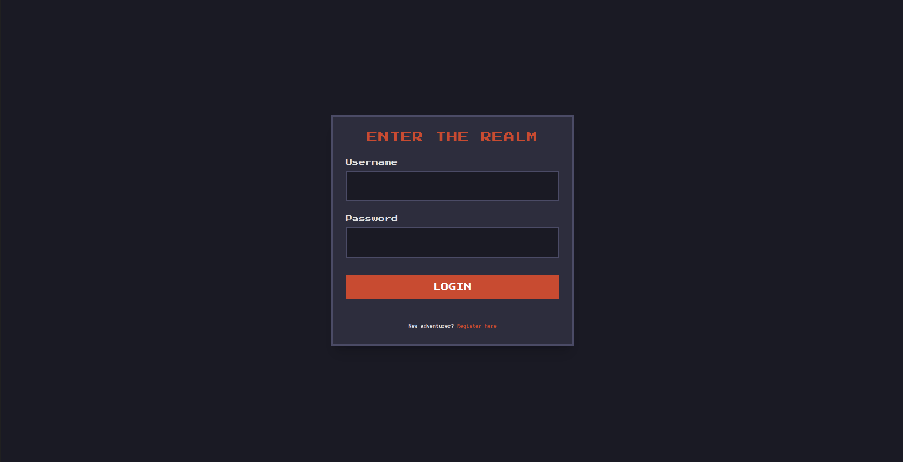

---

### Dashboard

Manage your hero, monitor vital stats, check character progression, and navigate all game systems seamlessly.

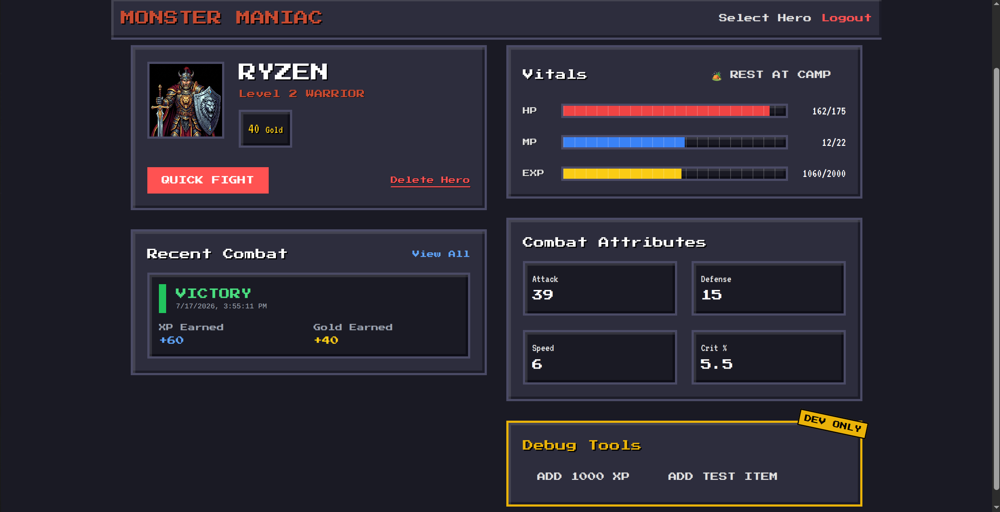

---

### Inventory

View, organize, and consume collected loot, potions, and crafting materials in a responsive grid layout.

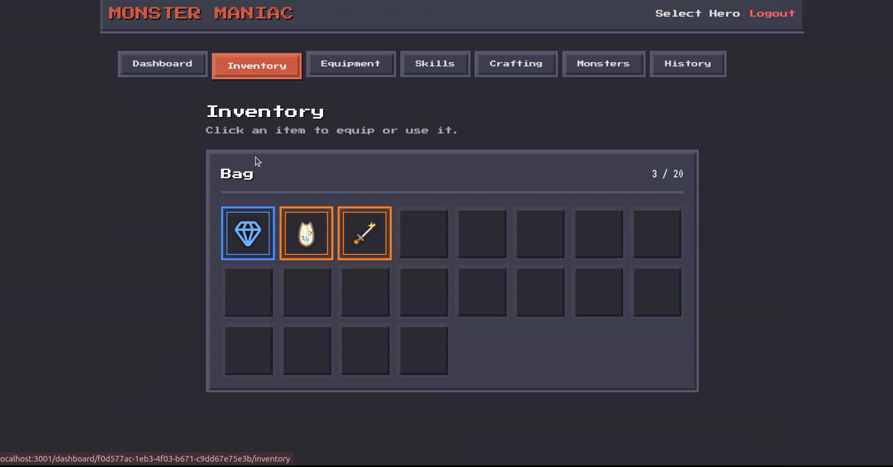

---

### Equipment

Equip weapons, armor, and accessories directly onto your character to boost attack, defense, and combat effectiveness.

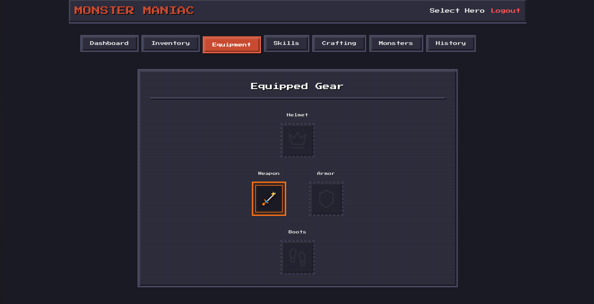

---

### Crafting

Combine harvested materials and discovered recipes to forge legendary gear and potent consumables.

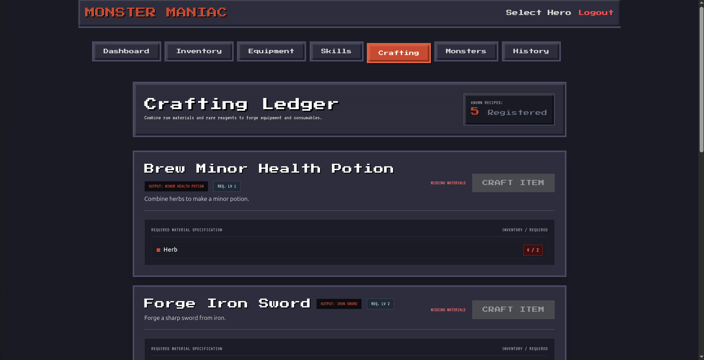

---

### Skills

Unlock and review class-specific active and passive abilities powered by character progression and level milestones.

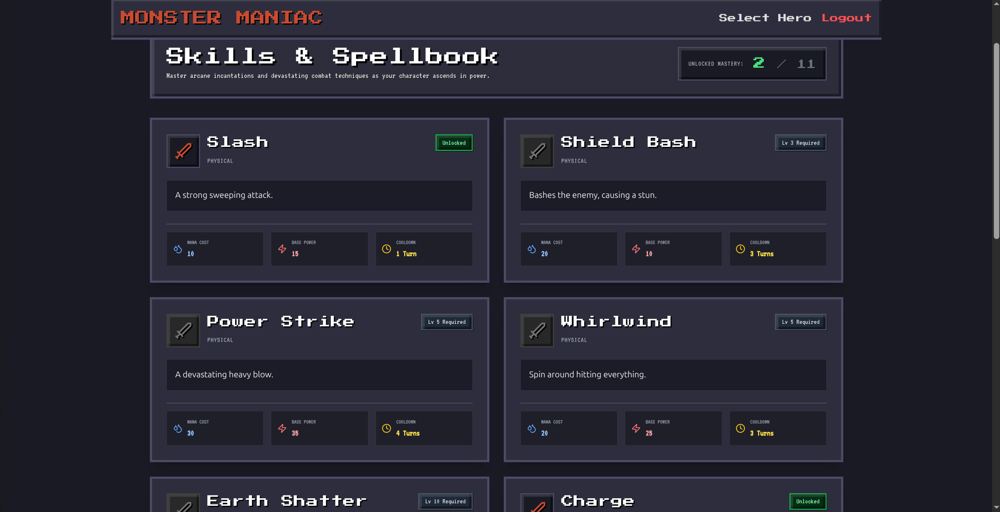

---

### Monsters

Explore the dangerous bestiary to analyze monster stats, difficulty ratings, and guaranteed loot drops before engaging.

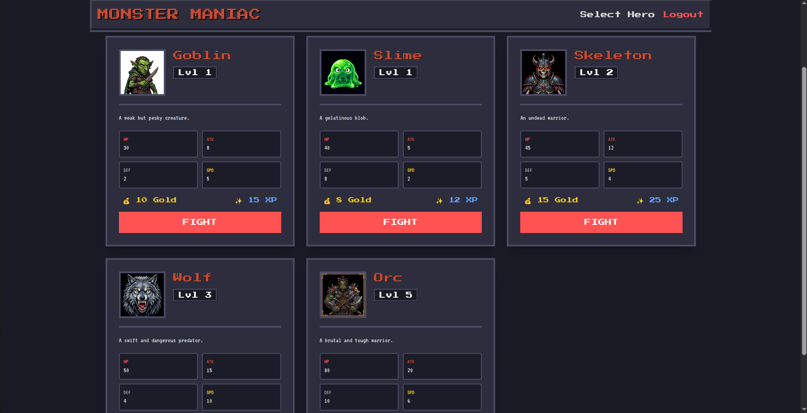

---

### Battle

Experience thrilling, turn-based combat featuring rich combat logs, damage calculations, and dynamic animations.

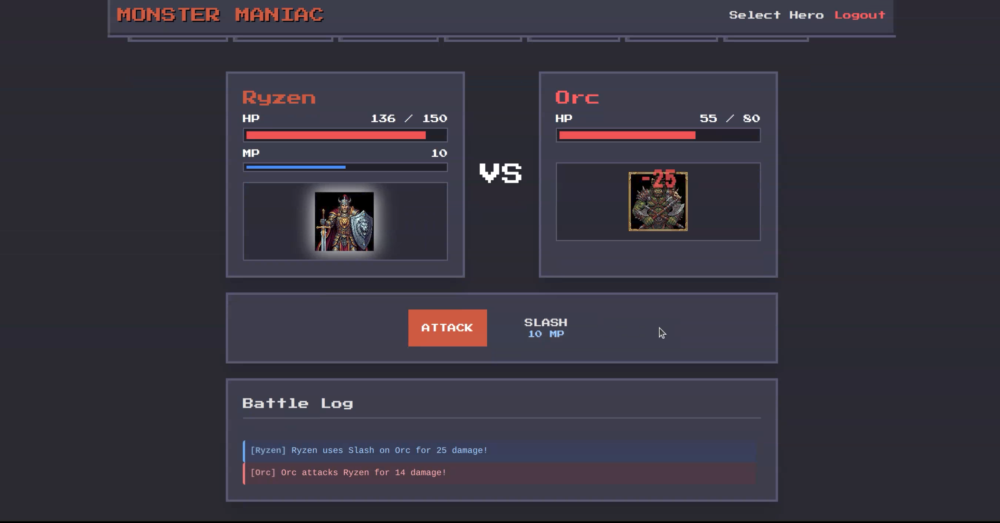

---

### Victory Screen

Celebrate triumphant battles with detailed post-match statistics, earned experience, gold rewards, and guaranteed legendary drops.

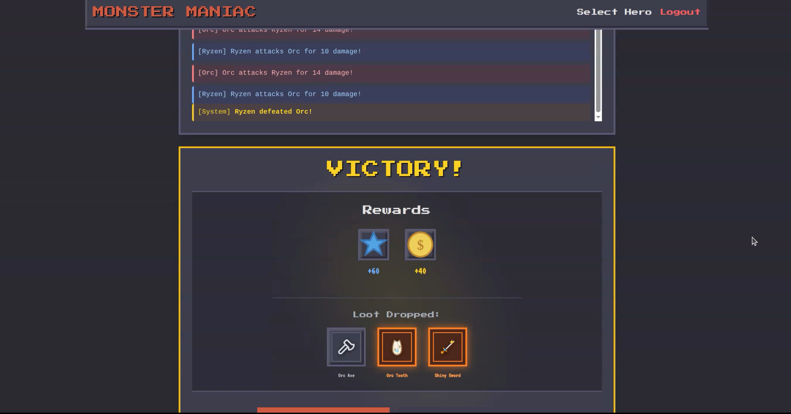

---

### Combat History

Review chronological battle logs and performance analytics to refine your combat strategies over time.

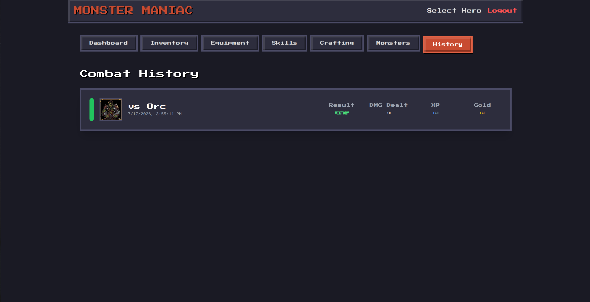

---

## ✨ Features

### 🔐 Authentication
- **Secure JWT Provisioning**: Stateless token-based authentication protecting all REST API endpoints.
- **Role-Based Access Control (RBAC)**: Distinct permissions for `ROLE_PLAYER` and `ROLE_ADMIN` identities.
- **BCrypt Encryption**: Industry-standard cryptographic password hashing.

### 🧙‍♂️ Character System
- **Multi-Class Roster**: Choose between distinct classes (Warrior, Mage, Rogue) with tailored base stat scaling.
- **Dynamic Progression**: Experience gains, level progression, and stat growth tracked in real-time.
- **Account Multi-Hero Support**: Create and manage multiple heroes under a single user account.

### ⚔️ Combat
- **Turn-Based Engine**: Precise backend calculations for physical attack, magical resistance, speed priority, and critical hits.
- **Deterministic & Guaranteed Drops**: Accurate reward distribution ensuring reliable legendary drops (e.g., Orc Tooth & Shiny Sword).
- **Comprehensive Battle Logging**: Full turn logs recording damage dealt, damage taken, healing, and skill executions.

### 🎒 Inventory
- **Stackable & Unique Slots**: Intelligent inventory management supporting stackable consumables/materials and unique equipment pieces.
- **Capacity Management**: Enforced slot limits (`20 slots` standard capacity) with clean exception handling.
- **Consumable Integration**: Instant health and mana restoration applied directly to live character stats when potions are consumed.

### 🛡️ Equipment
- **Stat Modifiers**: Equipping weapons, helmets, armor, and boots recalculates total character power immediately (`CharacterStatsCalculator`).
- **Slot-Specific Constraints**: Dedicated slots preventing incompatible gear assignments.

### 🔨 Crafting
- **Recipe-Driven Synthesis**: Check required ingredient quantities and synthesize new items automatically.
- **Material Consumption**: Atomic transactions verifying inventory availability, deducting ingredients, and granting crafted items cleanly.

### ⚡ Skills
- **Class-Restricted Abilities**: Unlock potent abilities restricted by character class and level prerequisites.
- **Resource Management**: Mana consumption, cooldown timers, and scaling base damage values handled server-side.

### 🐉 Monster System
- **Rich Bestiary**: Diverse enemies ranging from Slimes and Goblins to Orcs and Alpha Wolves.
- **Flexible Loot Tables**: Subquery-driven database associations binding exact items and drop probabilities (`100%` guaranteed drops where configured).

### 📱 Responsive UI
- **Tailwind & Next.js App Router**: Optimized, responsive pixel-art styled interfaces running smoothly across desktop and mobile screens.
- **Visual Micro-Animations**: Rich hover states, dynamic health/mana bars, and glowing legendary loot frames.

### 🐳 Docker
- **Multi-Container Orchestration**: Fully automated environment setup with Docker Compose.
- **Zero-Configuration Setup**: Postgres database provisioning, schema migrations, backend API, and frontend client spin up simultaneously.

### 🏛️ Clean Architecture
- **Package-by-Feature Design**: Modular separation (`auth`, `character`, `combat`, `inventory`, `admin`).
- **Strict Layer Decoupling**: Domain models remain independent of frameworks, databases, and UI representations.

### 👑 Admin Features
- **Full CMS Control**: Create, update, or delete Monsters, Items, Skills, and Recipes dynamically without recompilation.
- **User Moderation**: Manage player roles, ban violators, and inspect system-wide entities.

---

## 🛠️ Tech Stack

| Category | Technology | Purpose & Description |
| :--- | :--- | :--- |
| **Frontend** | **Next.js 14** (App Router) | Modern React framework providing server/client components and optimized routing. |
| **Backend** | **Spring Boot 3.2** | Enterprise-grade Java framework powering RESTful APIs and transactional business logic. |
| **Database** | **PostgreSQL 16** | Relational database handling complex entity relationships, foreign keys, and JSON logs. |
| **Authentication** | **Spring Security + JWT** | Stateless authentication layer securing endpoints with signed JSON Web Tokens. |
| **Containerization** | **Docker & Docker Compose** | Multi-service container orchestration isolating database, API, and web tiers. |
| **Build Tools** | **Maven & npm** | Dependency management and build lifecycle execution for Java and TypeScript. |
| **Languages** | **Java 21 LTS & TypeScript** | Strongly-typed languages ensuring compile-time safety and self-documenting code. |

---

## 🏛️ Architecture

Monster Maniac is architected around **Clean Architecture** and **SOLID Principles** to ensure high testability, maintainability, and scalability:

```
+-----------------------------------------------------------------------------+
|                            PRESENTATION LAYER                               |
|        REST Controllers (AuthController, CombatController, etc.)            |
+-----------------------------------------------------------------------------+
                                      |
                                      v
+-----------------------------------------------------------------------------+
|                             APPLICATION LAYER                               |
|       Service Classes (CombatService, InventoryService, AuthService)        |
+-----------------------------------------------------------------------------+
                                      |
                                      v
+-----------------------------------------------------------------------------+
|                               DOMAIN LAYER                                  |
|         Core Entities, Value Objects, Domain Logic & Specifications         |
|             (Character, Monster, Inventory, CharacterStats)                 |
+-----------------------------------------------------------------------------+
                                      ^
                                      |
+-----------------------------------------------------------------------------+
|                            INFRASTRUCTURE LAYER                             |
|       Spring Data JPA Repositories, Flyway Migrations, Database Drivers     |
+-----------------------------------------------------------------------------+
```

- **Clean Architecture**: Domain entities (`Character`, `Monster`, `Inventory`) reside at the center and have zero dependencies on external frameworks or SQL details.
- **SOLID Principles**: Single Responsibility across domain services; Open/Closed design allowing new combat items and mechanics without modifying core loops.
- **Layer Separation**: Clear demarcation between `Presentation` (REST Controllers & DTOs), `Application` (Use Case orchestrators), `Domain` (Pure business rules), and `Infrastructure` (Database persistence).
- **REST APIs & DTOs**: Internal domain models are strictly separated from network payloads using Data Transfer Objects (`CombatResponse`, `CharacterResponse`) to protect internal state.
- **Flyway Database Migrations**: Version-controlled SQL scripts (`V1` through `V10`) guaranteeing repeatable, idempotent schema evolution.

---

## 📂 Project Structure

```
rpg-backend-engine/
├── backend/
│   ├── src/main/java/com/rpgengine/
│   │   ├── admin/             # Admin management use cases and controllers
│   │   ├── auth/              # JWT security, authentication, and registration
│   │   ├── character/         # Character creation, stats, and leveling logic
│   │   ├── combat/            # Turn-based combat engine, loot generator, history
│   │   ├── common/            # Global exception handling, base DTOs, utilities
│   │   └── inventory/         # Inventory slots, equipment items, crafting
│   ├── src/main/resources/
│   │   ├── db/migration/      # Flyway SQL migrations (V1..V10)
│   │   └── application.yml    # Spring Boot backend configuration
│   └── pom.xml                # Maven configuration & dependency tree
├── frontend/
│   ├── src/app/
│   │   ├── dashboard/         # Protected player dashboard routes & views
│   │   ├── login/             # Authentication login portal
│   │   ├── register/          # New user account registration
│   │   └── page.tsx           # Public landing page
│   ├── src/components/        # Reusable UI cards, modals, navigation bars
│   └── package.json           # Node.js dependencies & scripts
├── docs/
│   └── images/                # Walkthrough screenshots & graphical assets
├── docker-compose.yml         # Multi-container service configuration
└── README.md                  # Project documentation
```

---

## 🚀 Getting Started

### Requirements
- **Docker** and **Docker Compose** (Recommended for instant full-stack setup)
- **Java 21 LTS** & **Maven** (If running backend locally outside Docker)
- **Node.js 18+** & **npm** (If running frontend locally outside Docker)
- **PostgreSQL 16** (If running locally outside Docker)

---

### Installation & Running with Docker (Recommended)

The easiest way to experience Monster Maniac is via Docker Compose, which automatically builds and starts the database, backend engine, and frontend web client.

1. **Clone the repository**:
   ```bash
   git clone https://github.com/yourusername/monster-maniac.git
   cd monster-maniac
   ```

2. **Launch the stack**:
   ```bash
   docker compose up --build
   ```

3. **Access the application**:
   - 🎮 **Frontend Web Application**: [http://localhost:3001](http://localhost:3001)
   - ⚙️ **Backend REST API**: [http://localhost:8080](http://localhost:8080)
   - 🐘 **pgAdmin 4 Console**: [http://localhost:5050](http://localhost:5050)

*Note: Flyway migrations automatically seed the database with initial monsters, items, and an admin profile (`admin` / `admin`).*

---

### Running Locally (Without Docker)

#### 1. Database Setup
Ensure a local PostgreSQL instance is running on port `5432` with a database named `rpg_engine` created:
```sql
CREATE DATABASE rpg_engine;
CREATE USER rpg_user WITH ENCRYPTED PASSWORD 'rpg_password';
GRANT ALL PRIVILEGES ON DATABASE rpg_engine TO rpg_user;
```

#### 2. Backend API
```bash
cd backend
mvn clean install
mvn spring-boot:run
```

#### 3. Frontend Application
```bash
cd frontend
npm install
npm run dev
```

---

## 🎮 Gameplay

- **Character Creation**: Begin by naming your hero and selecting a specialization (`Warrior`, `Mage`, or `Rogue`). Each class starts with distinct health, attack, and speed scaling.
- **Combat**: Navigate to the Bestiary (`/dashboard/[characterId]/combat`) and challenge monsters. Combat proceeds in turn-based rounds where damage is calculated based on attack power minus defense mitigation.
- **Loot & Guaranteed Drops**: Winning battles awards experience points, gold, and drops items directly into your inventory. Defeating mighty foes like the **Orc** guarantees high-tier rewards (`100%` drop rate for **Orc Tooth** and **Shiny Sword**).
- **Equipment**: Open your inventory (`/dashboard/[characterId]/equipment`) to equip weapons and armor pieces. Equipped gear immediately augments your base stats.
- **Skills**: As your character earns experience and levels up, unlock class-specific abilities (`Whirlwind`, `Execute`, `Berserk`) to unleash devastating attacks in battle.
- **Crafting**: Gather materials and visit the forge (`/dashboard/[characterId]/crafting`) to synthesize advanced equipment and potent consumables from recipes.

---

## 🧩 Design Patterns

Monster Maniac incorporates industry-standard architectural and software design patterns:

- **Layered Clean Architecture**: Strict boundaries separating `Presentation`, `Application`, `Domain`, and `Infrastructure` layers to preserve business rules.
- **Repository Pattern**: Spring Data JPA repositories abstracting raw SQL queries and encapsulating persistence operations inside clean interfaces (`InventoryRepository`, `ItemRepository`).
- **Service Layer Pattern**: Transactional application services (`CombatService`, `InventoryService`, `CharacterService`) coordinating multi-step domain workflows and atomic database saves.
- **Data Transfer Object (DTO) Pattern**: Decoupling REST payloads (`LoginRequest`, `CombatResponse`) from internal entity representations to prevent over-posting and circular JSON serialization.
- **Factory & Builder Patterns**: Clean static instantiation methods (`Character.createNew()`) ensuring domain objects are constructed in a valid, fully initialized state.
- **Strategy & Calculator Patterns**: Encapsulated algorithmic logic separated from data classes (`CharacterStatsCalculator.calculateTotalStats()` and `LootGenerator.generateLoot()`).
- **Singleton Pattern**: Managed lifecycle beans within the Spring IoC container ensuring thread-safe, stateless service execution across concurrent requests.

---

## 🔮 Future Improvements

- **Real-Time Multiplayer PvP**: Integrating WebSockets (Spring WebSocket + Stomp) to enable synchronized, player-versus-player arena battles.
- **Guild & Party Systems**: Enabling players to form cooperative guilds, share guild bank inventories, and tackle multi-stage boss raids.
- **Advanced AI Behaviors**: Expanding monster AI with adaptive combat strategies, self-healing phases, and conditional skill triggers.
- **Audio & Sound Effects**: Integrating background fantasy scores and responsive micro-audio feedback for attacks, critical strikes, and level-ups.

---

## 📄 License

This project is licensed under the **MIT License**. See the [LICENSE](file:///home/ryzenx21/Projects/rpg-backend-engine/LICENSE) file for details.
