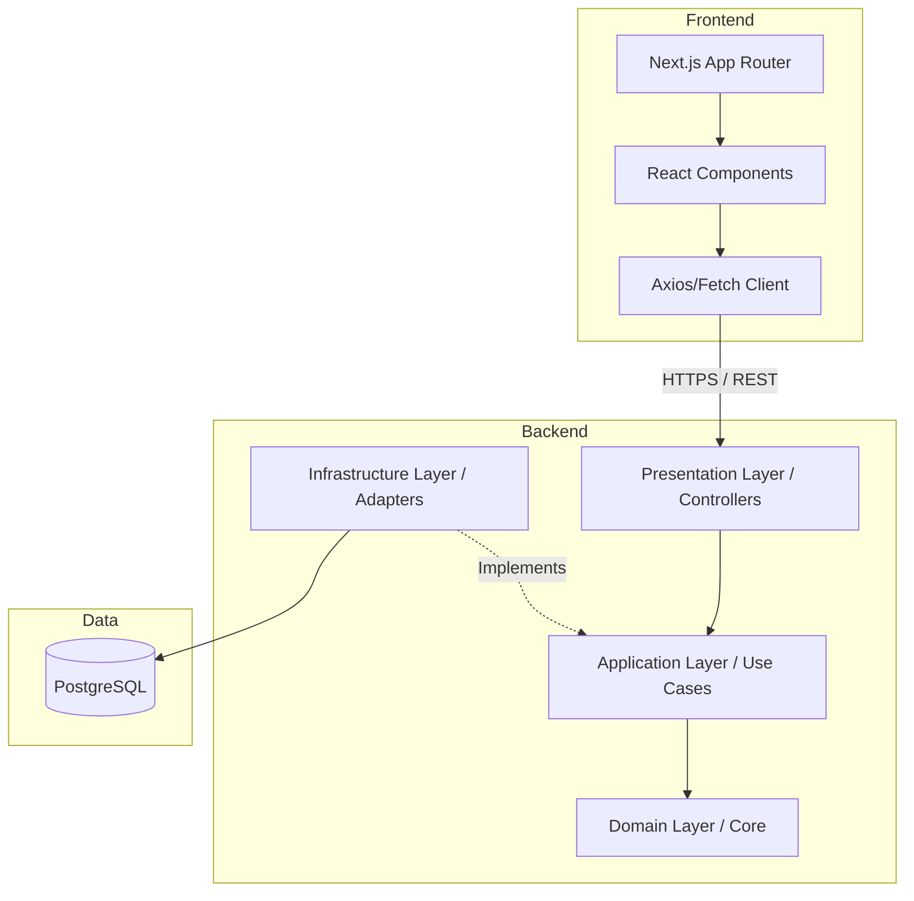

# Architecture Overview

This project utilizes a Clean Architecture (Hexagonal Architecture) model combined with Domain-Driven Design (DDD) to encapsulate and protect the core business logic of the RPG engine.

## Architectural Layers

1. **Domain Layer**: The core of the system. Contains entities (Character, Stats, Inventory), value objects, and domain interfaces. It has zero dependencies on any external framework (including Spring).
2. **Application Layer**: Contains Use Cases that coordinate domain objects to fulfill business requirements (e.g., `AuthService`, `CraftItemUseCase`).
3. **Infrastructure Layer**: Implements the adapters for databases (Spring Data JPA), security (`SecurityConfig`, `JwtAuthenticationFilter`), messaging, and external APIs.
4. **Presentation Layer**: Exposes the REST API controllers (`AuthController`) consumed by the frontend.

## Module Dependency

